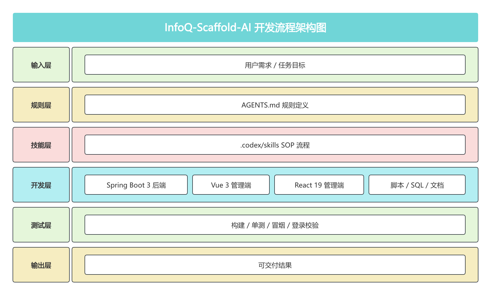

<div align="center">


# InfoQ-Scaffold-AI

> 一个以 AI 为主力研发者的全栈工程脚手架。仓库通过 `AGENTS.md` 约束协作规则，通过 `.codex/skills` 固化自动化 SOP，再把能力落到 Spring Boot 3 后端、Vue 3 管理端、React 19 管理端、脚本、SQL 与文档工作区中。


</div>

---

## 项目简介

`infoq-scaffold-ai` 是一个以 AI 为主力研发者的全栈工程脚手架。它把规则、SOP、代码、验证和文档放在同一仓库闭环内，让 AI 不只是“辅助写代码”，而是按约束完成交付。

核心协作方式：

- 人定义目标、边界、验收标准和最终决策
- AI 负责检索规则、修改实现、执行验证和维护文档
- 仓库负责沉淀 `AGENTS.md`、skills、脚本和文档资产

## 项目定位

本项目面向三个核心场景：

1. **AI-first 工程协作**：通过 `AGENTS.md` 和 skills 让 Codex 先读规则、再动代码、最后做验证。
2. **双前端后台基线**：同时提供 Vue 3 + Element Plus 与 React 19 + Ant Design 两套管理端实现。
3. **可运行、可验证、可扩展**：后端、前端、脚本、SQL、文档、浏览器验证和版本升级都在同一仓库闭环完成。

## 项目结构

```text
infoq-scaffold-ai
├── AGENTS.md                         # AI 协作规则、触发条件与工程边界
├── .codex/skills                     # 可复用的任务级 SOP 与自动化脚本
├── infoq-scaffold-backend            # Spring Boot 3 多模块后端
│   ├── infoq-admin                   # 启动入口与 API 聚合
│   ├── infoq-core                    # 通用内核与 BOM / common / data
│   ├── infoq-modules                 # 业务模块（当前以 system 为主）
│   └── infoq-plugin                  # 插件化能力模块
├── infoq-scaffold-frontend-vue       # Vue 3 + Element Plus 管理端
├── infoq-scaffold-frontend-react     # React 19 + Ant Design 管理端
├── script                            # 本地联调、Docker 部署与辅助脚本
├── sql                               # 数据初始化脚本
└── doc                               # 项目文档、部署说明、架构与协作资料
```

## 项目技术栈

| 维度 | 技术栈 |
| --- | --- |
| AI 协作层 | Codex、`AGENTS.md`、`.codex/skills` |
| 后端 | Spring Boot 3.5.10、JDK 17、MyBatis-Plus、Sa-Token、Redisson |
| Vue 管理端 | Vue 3、TypeScript、Vite 6、Element Plus |
| React 管理端 | React 19、TypeScript、Vite、Ant Design 6 |
| 存储与中间件 | MySQL 8、Redis 7、MinIO |
| 构建与验证 | Maven、pnpm、Docker Compose、后端冒烟测试、登录校验、浏览器自动化 |

## 项目功能清单

- AI 协作治理：`AGENTS.md` 路由规则，`.codex/skills` 固化 SOP
- 研发自动化：本地联调、登录校验、后端冒烟、浏览器验证、版本升级
- 后端业务基线：认证授权、组织权限、字典参数、通知客户端、OSS、日志与监控
- 双前端交付：Vue 3 + Element Plus 与 React 19 + Ant Design 两套管理端
- 插件化扩展：encrypt、mail、sse、websocket、doc、translation、sensitive、excel、log 等能力模块

## 相关文档

- 协作体系：[AGENTS 指南](./doc/agents-guide.md) / [Skills 指南](./doc/skills-guide.md)
- 部署交付：[项目部署前准备](./doc/deploy-prerequisites.md) / [手动部署说明](./doc/manual-deploy.md) / [Docker Compose 部署说明](./doc/docker-compose-deploy.md)
- 扩展治理：[插件目录与开关策略](./doc/plugin-catalog.md)

## 架构图



## 演示图例

|                                          |                                            |
|------------------------------------------|--------------------------------------------|
|         |             |
|  |    |
|  |    |
|  |    |
|  |    |
|  |    |
|  | |
|  |    |


## License

[MIT License](./LICENSE)
