<div align="center">

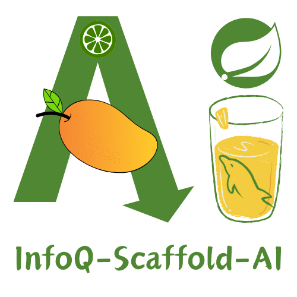

# InfoQ-Scaffold-AI

> 一个以 AI 为主力研发者的全栈工程脚手架。仓库通过 `AGENTS.md` 约束协作规则，通过 `.agents/skills` 固化自动化 SOP，并以 `OpenSpec` 管理长期规格与变更，将能力落到 Spring Boot 3 后端、Vue/React 管理端、Vue/React 小程序端、脚本、SQL、MCP 与文档工作区中。社区：[Linux DO](https://linux.do)


</div>

---

## 项目简介

`infoq-scaffold-ai` 把 AI 协作规则、自动化 SOP、OpenSpec 规格资产、业务代码、验证流程和交付证据放进同一仓库闭环。这个仓库不把 AI 当成“代码补全工具”，而是把它当成遵循规约、执行验证、维护规格与文档的工程参与者。

当前仓库同时包含：

- Spring Boot 3.5 多模块后端
- Vue 3 + Element Plus 管理端
- React 19 + Ant Design 管理端
- uni-app + Vue 3 小程序端
- Taro + React 小程序端
- 根 `doc/` 正文真值源与 `infoq-scaffold-docs` 文档站展示层
- 根级与工作区级 `AGENTS.md`
- `OpenSpec` 规格与变更目录
- 项目级 MCP 配置与使用文档
- 部署脚本、SQL 初始化脚本、协作文档

## 项目定位

本项目面向四类核心场景：

1. **AI-first 工程协作**：通过根级和工作区级 `AGENTS.md`、skills、`OpenSpec`、MCP 让 Codex 先对齐规格、再做修改、最后执行验证。
2. **双管理端基线**：同时提供 Vue 3 + Element Plus 与 React 19 + Ant Design 两套管理端实现。
3. **双小程序端基线**：同时提供 uni-app Vue 与 Taro React 两套小程序实现。
4. **可运行、可验证、可部署**：本地联调、单元测试、浏览器验证、小程序 DevTools 打开、Docker Compose 部署和版本升级都在同一仓库闭环完成。

## 仓库结构

```text
infoq-scaffold-ai
├── AGENTS.md
├── .agents/skills
├── .codex/config.toml
├── openspec
├── infoq-scaffold-backend
│   ├── infoq-admin
│   ├── infoq-core
│   ├── infoq-modules
│   └── infoq-plugin
├── infoq-scaffold-frontend-vue
├── infoq-scaffold-frontend-react
├── infoq-scaffold-frontend-weapp-vue
├── infoq-scaffold-frontend-weapp-react
├── infoq-scaffold-docs
├── script
├── sql
└── doc
```

## 技术栈

| 维度 | 技术栈 |
| --- | --- |
| AI 协作层 | Codex、`AGENTS.md`、`.agents/skills`、`OpenSpec`、`.codex/config.toml` |
| 后端 | Spring Boot `3.5.10`、JDK `17`、MyBatis-Plus `3.5.16`、Sa-Token `1.44.0` |
| Vue 管理端 | Vue `3.5.30`、TypeScript、Vite `6.4.1`、Element Plus `2.11.9`、Vitest |
| React 管理端 | React `19.2.4`、TypeScript、Vite `7.3.1`、Ant Design `6.3.3`、React Router `7.13.1`、Vitest |
| Vue 小程序端 | uni-app 3、Vue 3、TypeScript、Pinia、WeChat Mini Program |
| React 小程序端 | Taro 4、React 18、TypeScript、Zustand、WeChat Mini Program |
| 存储与中间件 | MySQL 8、Redis 7、MinIO |
| 验证与自动化 | Maven、pnpm、浏览器自动化、Chrome DevTools MCP、OpenAI Docs MCP、WeChat DevTools |

## AI 协作资产

### 1. `AGENTS.md` 分层规则

- 根规则：[`AGENTS.md`](./AGENTS.md)
- 后端规则：[`infoq-scaffold-backend/AGENTS.md`](./infoq-scaffold-backend/AGENTS.md)
- Vue 管理端规则：[`infoq-scaffold-frontend-vue/AGENTS.md`](./infoq-scaffold-frontend-vue/AGENTS.md)
- React 管理端规则：[`infoq-scaffold-frontend-react/AGENTS.md`](./infoq-scaffold-frontend-react/AGENTS.md)
- Vue 小程序规则：[`infoq-scaffold-frontend-weapp-vue/AGENTS.md`](./infoq-scaffold-frontend-weapp-vue/AGENTS.md)
- React 小程序规则：[`infoq-scaffold-frontend-weapp-react/AGENTS.md`](./infoq-scaffold-frontend-weapp-react/AGENTS.md)
- 文档站规则：[`infoq-scaffold-docs/AGENTS.md`](./infoq-scaffold-docs/AGENTS.md)

### 2. `.agents/skills`

当前仓库的 skill 结构遵循两条规则：

- 每个 skill 只做一类工作
- 除 `skill-creator` 外，仓库级 skill 统一使用 `infoq-` 前缀

其中最核心的 skill 分为：

- 通用浏览器自动化：`infoq-browser-automation`
- React 家族运行态验证：`infoq-react-runtime-verification`
- Vue 家族运行态验证：`infoq-vue-runtime-verification`
- React 家族单测：`infoq-react-unit-test-patterns`
- Vue 家族单测：`infoq-vue-unit-test-patterns`
- 后端冒烟、双机集群 smoke 与登录校验：`infoq-backend-smoke-test`、`infoq-login-success-check`
- OpenSpec 与项目参考：`infoq-openspec-delivery`、`infoq-project-reference`

React 家族和 Vue 家族 skill 会通过 `references/admin` 与 `references/weapp` 区分客户端，但不再保留共享底座型 skill 目录。

详见：

- [`doc/skills-guide.md`](./doc/skills-guide.md)
- [`doc/agents-guide.md`](./doc/agents-guide.md)
- [`doc/subagents-guide.md`](./doc/subagents-guide.md)

### 3. `OpenSpec`

新的规格主流程统一放在 `openspec/`：

- 项目级长期上下文：[`openspec/project.md`](./openspec/project.md)
- 当前真相规格：[`openspec/specs/README.md`](./openspec/specs/README.md)
- 活跃变更与归档：[`openspec/changes/README.md`](./openspec/changes/README.md)

默认的 OpenSpec 交付入口是 `infoq-openspec-delivery`。新的功能、行为变更或跨工作区任务，先在 `openspec/changes/<change-id>/` 建立或定位 change，再开始实现。

当用户明确要求 subagents 或 multi-expert execution 时，repo 级 custom agents 的真值放在 `.codex/agents/`，当前只保留 4 个角色：

- `requirements_expert`
- `technical_designer`
- `code_implementer`
- `auto_fixer`

`design.md`、`materials.md`、`review.md` 默认由主线程按需维护；重大 UI/UX 任务优先切到 `infoq-ui-ux-three-phase-protocol`。

### 4. 项目级 MCP

项目级 Codex MCP 配置已写入 [`.codex/config.toml`](./.codex/config.toml)。

当前默认启用：

- `playwright`
- `openai-docs`
- `chrome-devtools`

可选但默认禁用：

- `mysql`（只读；通过 `.codex/scripts/start_mysql_mcp.sh` 启动，并从 backend `application-local.yml` 派生连接配置）
- `redis`（只读；通过 `.codex/scripts/start_redis_mcp.sh` 启动，并从 backend `application-local.yml` 派生连接配置）

详见：

- [`doc/mcp-servers.md`](./doc/mcp-servers.md)

## 环境要求

| 组件 | 基线 |
| --- | --- |
| JDK | 17 |
| Maven | 3.9+ |
| Node.js | `>= 20.19.0` |
| pnpm | `>= 10.0.0` |
| MySQL | 8.x |
| Redis | 7.x |
| Docker Compose | 仅在脚本化部署时需要 |
| WeChat DevTools | 小程序本地联调或 e2e 时需要 |

## 快速开始

### 1. 后端

```bash
cd infoq-scaffold-backend
mvn spring-boot:run -pl infoq-admin
```

默认本地访问：

- 后端：`http://127.0.0.1:8080`
- 验证码接口：`http://127.0.0.1:8080/auth/code`

### 2. 管理端

Vue 管理端：

```bash
cd infoq-scaffold-frontend-vue
pnpm install
pnpm run dev
```

React 管理端：

```bash
cd infoq-scaffold-frontend-react
pnpm install
pnpm run dev
```

如果要通过 skill 启动后端 + 管理端联调：

```bash
bash .agents/skills/infoq-vue-runtime-verification/scripts/start_admin_dev_stack.sh
bash .agents/skills/infoq-react-runtime-verification/scripts/start_admin_dev_stack.sh
```

停止对应 skill 启动的联调进程：

```bash
bash .agents/skills/infoq-vue-runtime-verification/scripts/stop_admin_dev_stack.sh
bash .agents/skills/infoq-react-runtime-verification/scripts/stop_admin_dev_stack.sh
```

### 3. 小程序端

React 小程序在打开微信开发者工具前，先把 `infoq-scaffold-frontend-weapp-react/.env.development` 里的 `TARO_APP_ID` 改成你自己的 AppID，然后执行：

```bash
pnpm --dir infoq-scaffold-frontend-weapp-react build-open:weapp:dev
```

Vue 小程序同理，先修改 `infoq-scaffold-frontend-weapp-vue/.env.development` 的 `TARO_APP_ID`，再执行：

```bash
pnpm --dir infoq-scaffold-frontend-weapp-vue build-open:weapp:dev
```

如果 `TARO_APP_ID` 为空或是 `touristappid`，`script/build-open-wechat-devtools.mjs` 会直接失败。

## 常用命令

### 后端

```bash
cd infoq-scaffold-backend
mvn clean package -P dev
mvn -pl infoq-modules/infoq-system -am -DskipTests=false test
```

### Vue 管理端

```bash
cd infoq-scaffold-frontend-vue
pnpm run test:unit
pnpm run test:unit:coverage
pnpm run lint:eslint
pnpm run build:prod
```

### React 管理端

```bash
cd infoq-scaffold-frontend-react
pnpm run test
pnpm run test:coverage
pnpm run lint
pnpm run build:prod
```

### React 小程序端

```bash
cd infoq-scaffold-frontend-weapp-react
pnpm run test
pnpm run test:coverage
pnpm run lint
pnpm run verify:local
```

### Vue 小程序端

```bash
cd infoq-scaffold-frontend-weapp-vue
pnpm run typecheck
pnpm run test
pnpm run test:coverage
pnpm run verify:local
```

## 部署入口

### 后端与依赖服务

```bash
bash script/bin/infoq.sh deploy
```

说明：

- `bash script/bin/infoq.sh deploy` 直接使用后端生产配置里的 `infoq.quartz.bootstrap.deploy-id`；如果同一个版本不是多次发布，就保持这个值不变。
- 如果同一个版本需要再次发布，先更新 `infoq-scaffold-backend/infoq-admin/src/main/resources/application-prod.yml` 里的 `infoq.quartz.bootstrap.deploy-id`，再重新构建和发布。
- `bash script/bin/infoq.sh start` / `restart` 只会复用现有容器环境，不会改动生产配置中的 `infoq.quartz.bootstrap.deploy-id`。

### 前端与网关

```bash
bash script/bin/deploy-frontend.sh deploy
```

该脚本会部署：

- `infoq-frontend-vue`
- `infoq-frontend-react`
- `nginx-web`

详见：

- [`sql/infoq_scaffold_2.0.0.sql`](./sql/infoq_scaffold_2.0.0.sql)
- [`doc/deploy-prerequisites.md`](./doc/deploy-prerequisites.md)
- [`doc/manual-deploy.md`](./doc/manual-deploy.md)
- [`doc/docker-compose-deploy.md`](./doc/docker-compose-deploy.md)

## 验证建议

提交前至少执行对应工作区的最小验证：

- 后端改动：主流程验证 + 定向 Maven 测试
- Vue 管理端：`pnpm run test:unit` + `pnpm run build:prod`
- React 管理端：`pnpm run test` + `pnpm run build:prod`
- Vue 小程序端：`pnpm run typecheck` + `pnpm run test` + `pnpm run build:weapp:dev`
- React 小程序端：`pnpm run test` + `pnpm run lint` + `pnpm run build:weapp:dev`
- 文档站：`cd infoq-scaffold-docs && pnpm run docs:sync && pnpm run docs:check-links && pnpm run build`

如果改动影响浏览器运行态、登录、路由守卫、页面渲染或小程序 DevTools 打开流程，建议额外使用对应的 React 或 Vue 运行态 verification skill。

## 项目能力概览

- AI 协作治理：根级 / 工作区级 `AGENTS.md` 与 `.agents/skills`
- 研发自动化：后端冒烟、登录校验、浏览器验证、小程序 DevTools 打开、版本升级（含文档站同步）
- 后端业务基线：认证授权、组织权限、字典参数、通知客户端、OSS、日志监控、服务监控与 Hikari 连接池监控
- 多前端交付：Vue/React 管理端 + Vue/React 小程序端
- 插件化扩展：encrypt、mail、sse、websocket、doc、translation、sensitive、excel、log 等能力模块

## 文档导航

- 项目文档中心：[`doc/README.md`](./doc/README.md)
- 文档站展示层：[`infoq-scaffold-docs/README.md`](./infoq-scaffold-docs/README.md)
- 协作体系：
  - [`doc/agents-guide.md`](./doc/agents-guide.md)
  - [`doc/skills-guide.md`](./doc/skills-guide.md)
  - [`doc/subagents-guide.md`](./doc/subagents-guide.md)
- MCP：
  - [`doc/mcp-servers.md`](./doc/mcp-servers.md)
- 部署交付：
  - [`doc/deploy-prerequisites.md`](./doc/deploy-prerequisites.md)
  - [`doc/manual-deploy.md`](./doc/manual-deploy.md)
  - [`doc/docker-compose-deploy.md`](./doc/docker-compose-deploy.md)
- 扩展治理：
  - [`doc/plugin-catalog.md`](./doc/plugin-catalog.md)

## Admin后台演示图例

系统监控能力现已覆盖在线用户、登录日志、操作日志、定时任务、任务日志、缓存监控、服务监控和 Hikari 原生连接池监控。
其中连接池监控页面与接口已经按生产安全要求收敛为摘要视图，只展示数据源名、库类型、连接数、等待线程、最大池容量和占用率，不再向前端暴露 JDBC URL、账号、驱动类、P6Spy/Seata 标记或详细连接池参数。

|  |  |
| --- | --- |
| 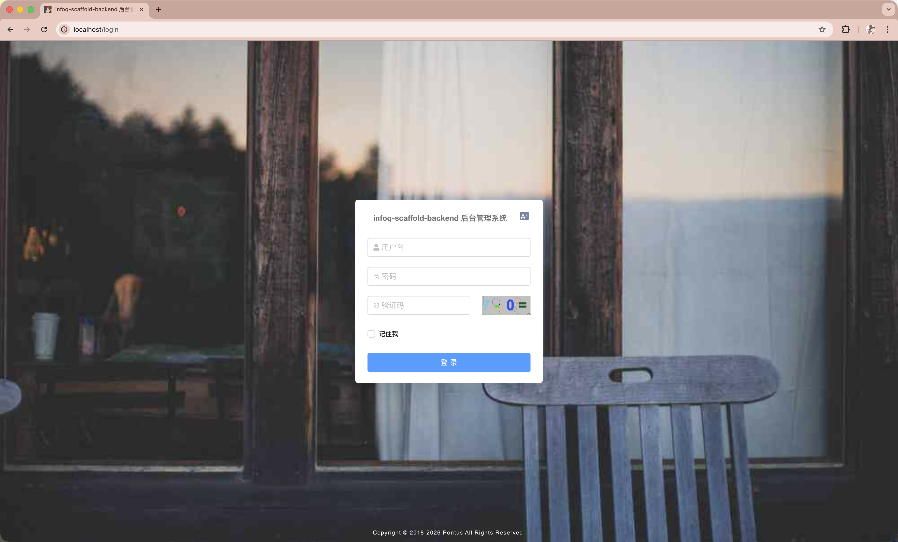 | 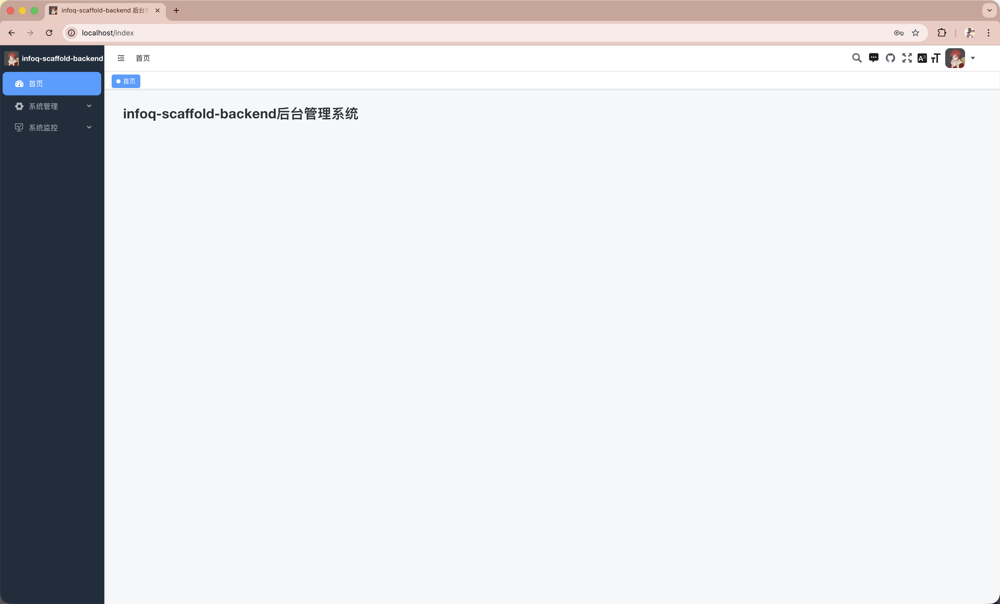 |
| 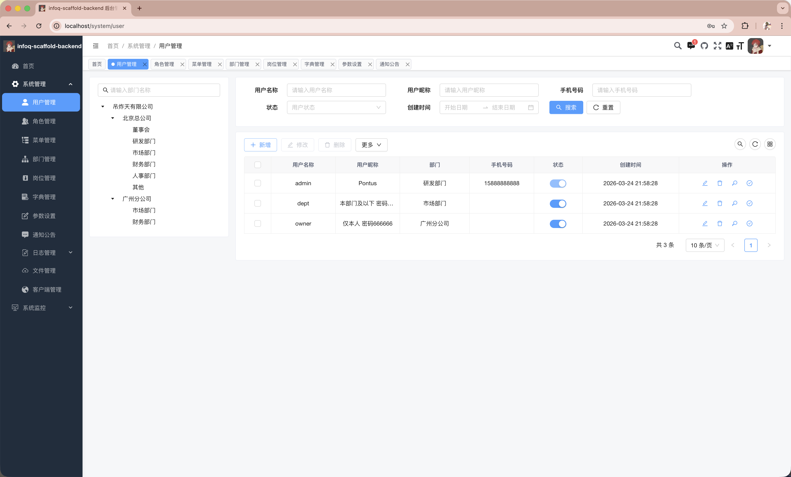 | 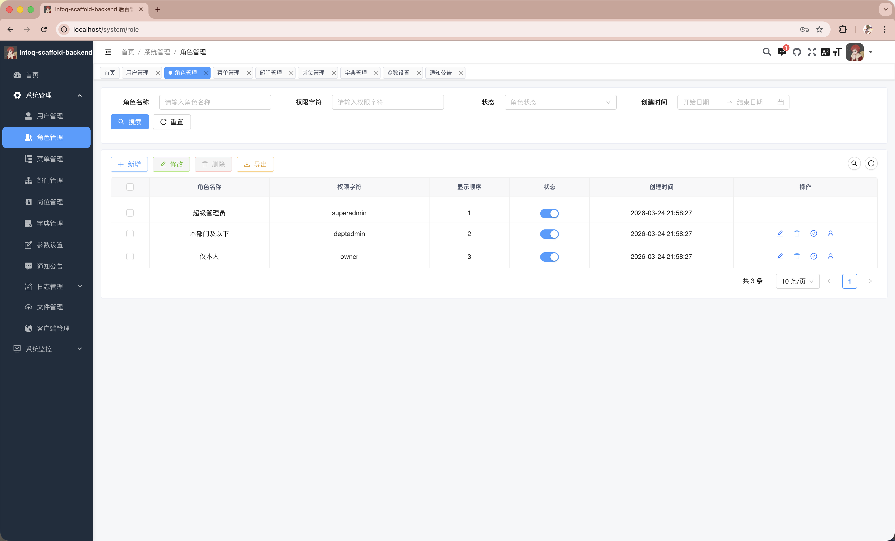 |
| 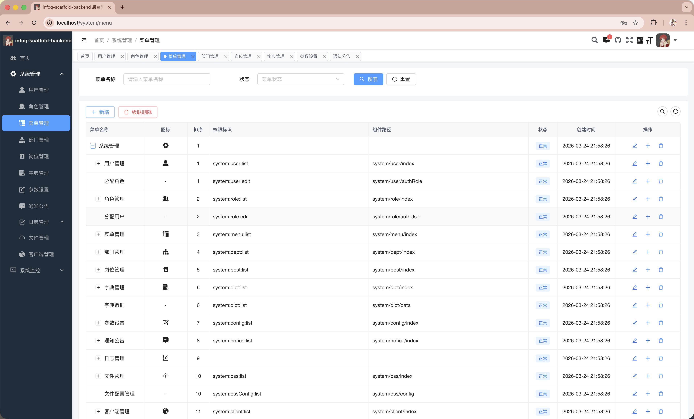 | 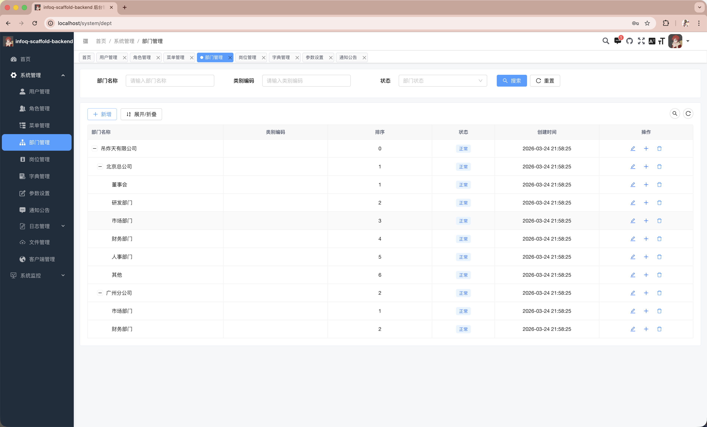 |
| 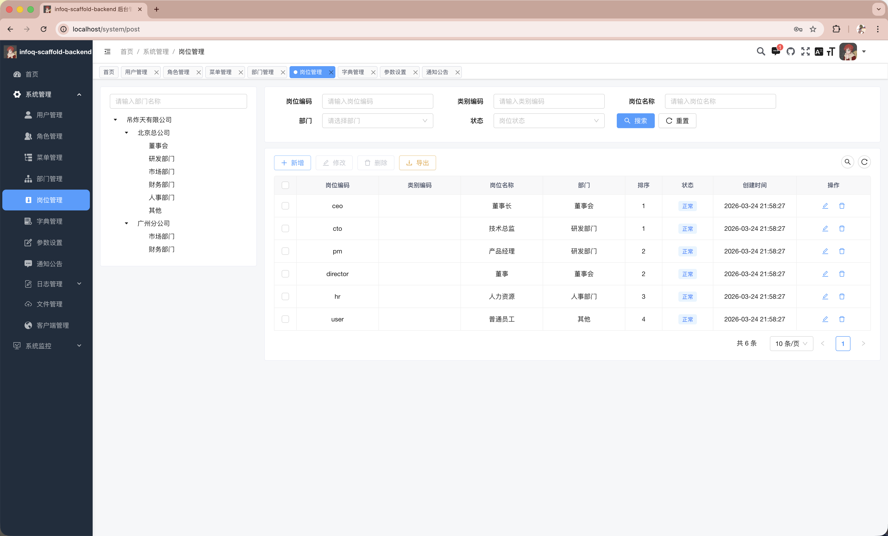 | 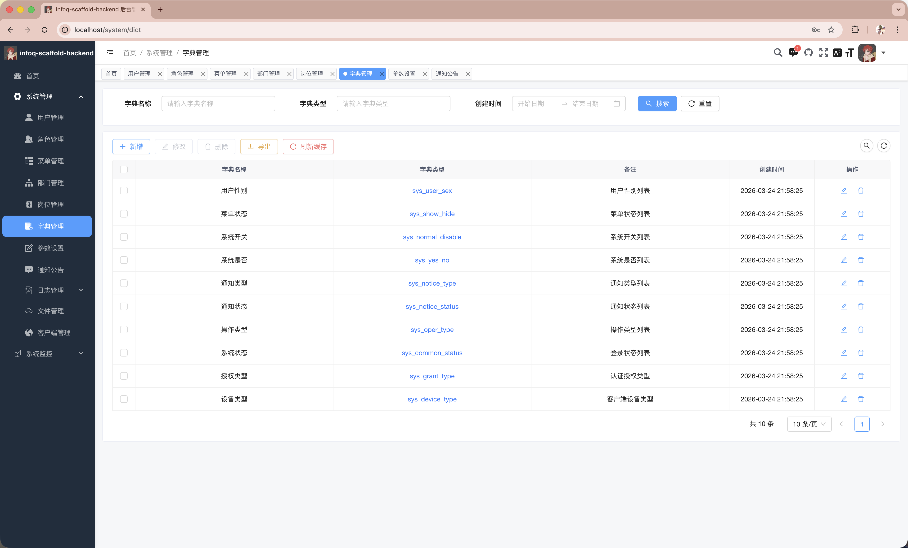 |
| 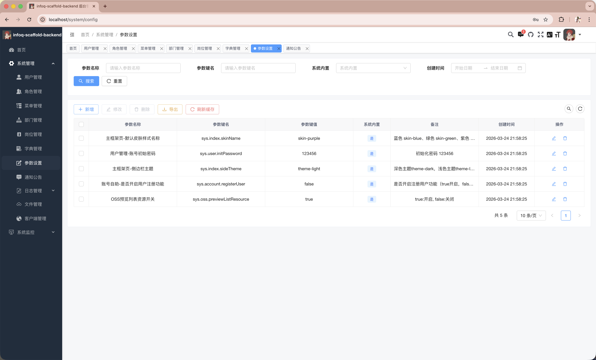 | 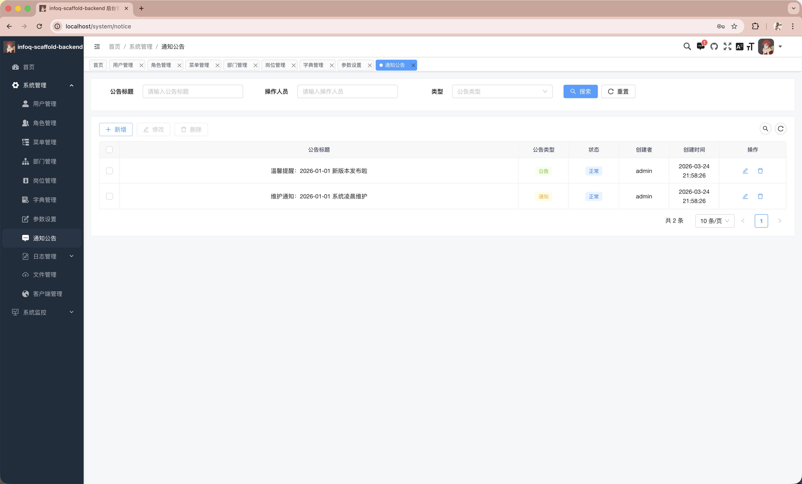 |
| 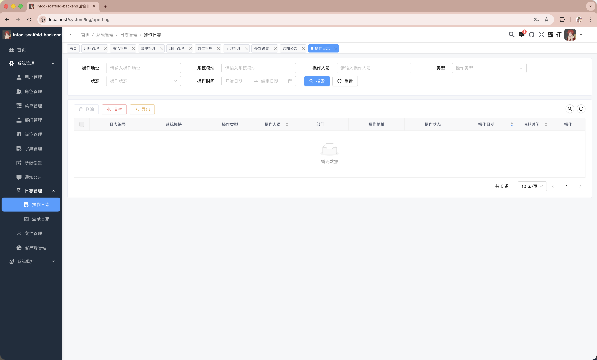 | 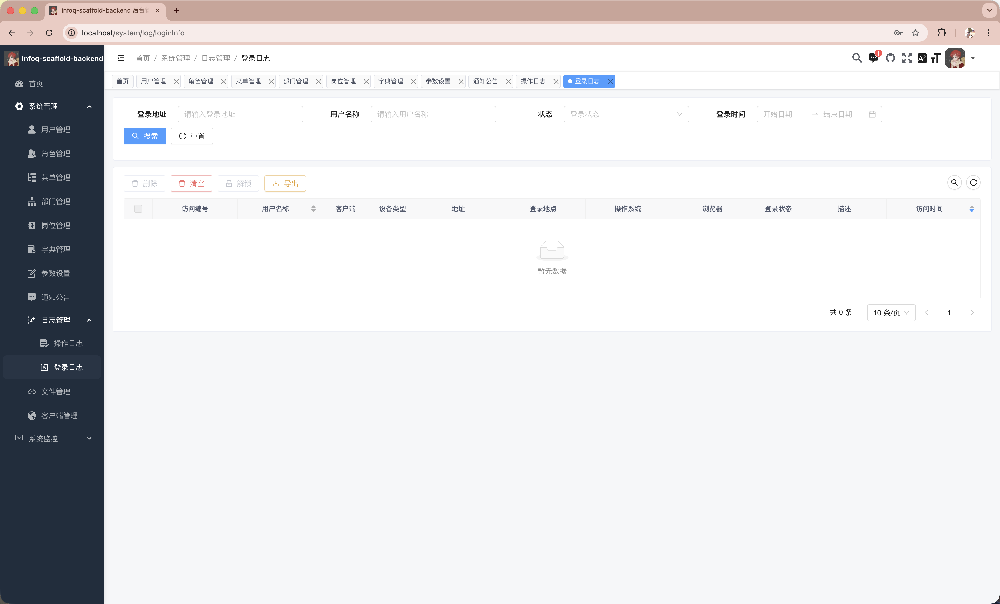 |
| 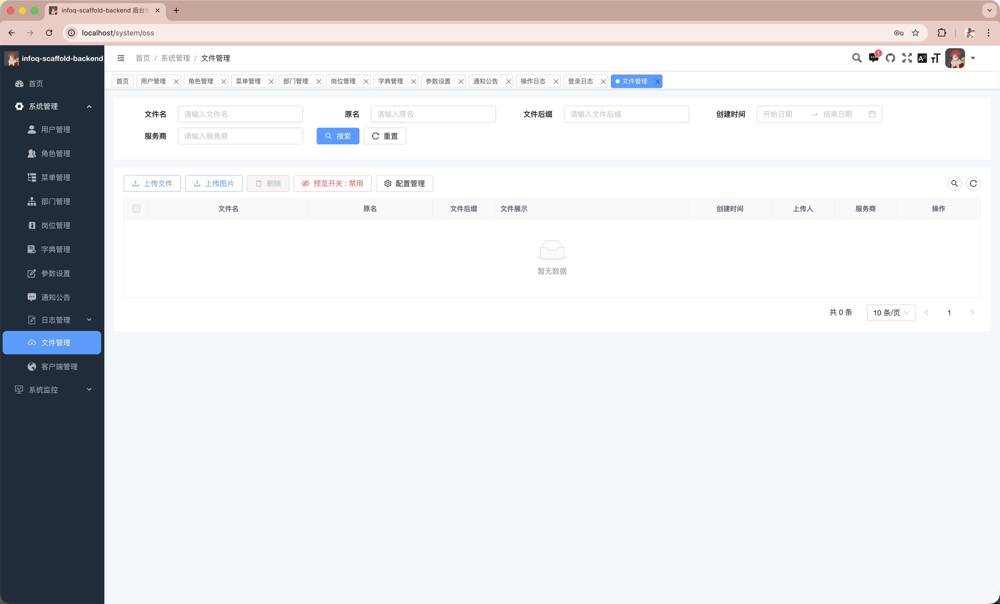 | 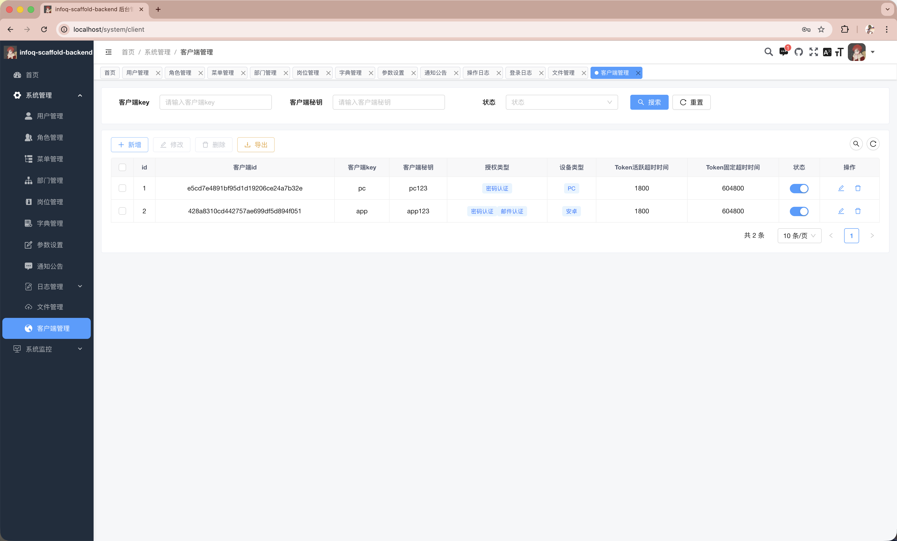 |
| 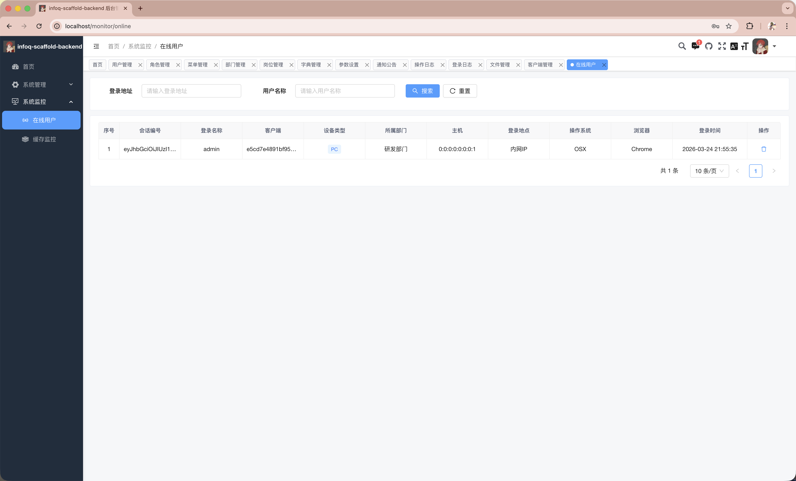 | 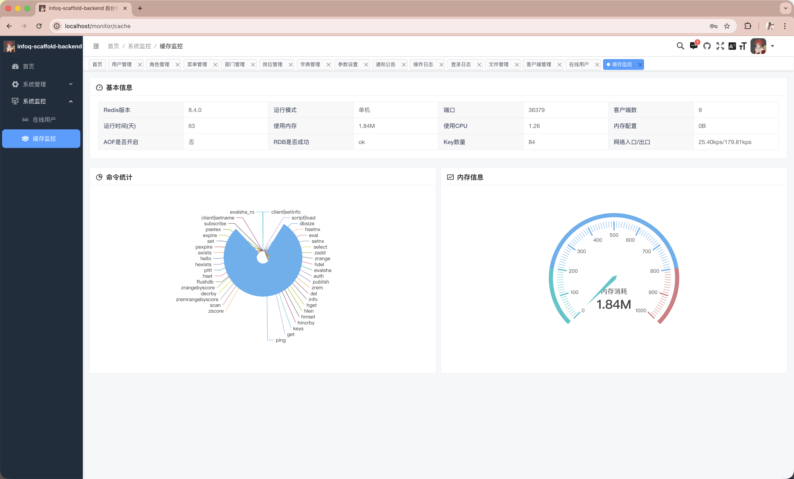 |

## Weapp后台演示图例

|                                    |                                    |
|------------------------------------|------------------------------------|
|  |  |
|  |   |

## License

[MIT License](./LICENSE)
